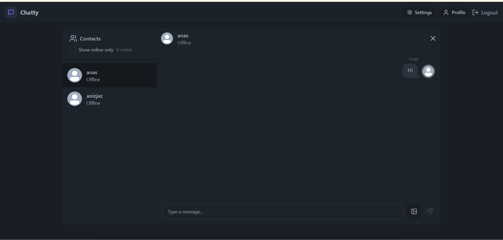
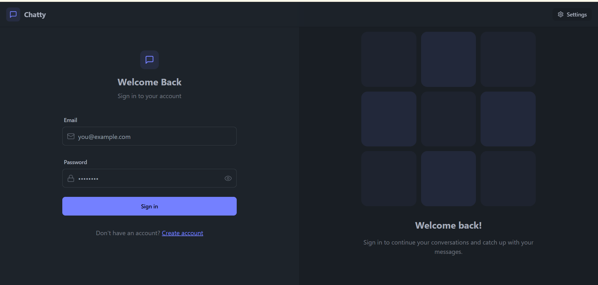

# Realtime Chat App

A full-stack real-time chat application built with the **MERN** stack (MongoDB, Express, React, Node.js) and **Socket.io**. This application allows users to send and receive messages instantly, share images, utilize authentication, and see online user status updates in real-time.


## 🚀 Features

- **Real-time Messaging**: Instant messaging powered by Socket.io.
- **Authentication & Authorization**: Secure signup and login using JWT (JSON Web Tokens).
- **Online User Status**: See who is currently online in real-time.
- **Global State Management**: Efficient state handling using **Zustand**.
- **Image Uploads**: Share images in chats (powered by **Cloudinary**).
- **Responsive Design**: Built with **TailwindCSS** and **DaisyUI** for a mobile-first, modern UI.
- **Theme Customization**: various themes available via DaisyUI.
- **Error Handling**: comprehensive error messages and toast notifications (`react-hot-toast`).

## 🛠️ Tech Stack

### Frontend
- **React** (Vite)
- **TailwindCSS** & **DaisyUI** (Styling)
- **Zustand** (State Management)
- **Axios** (HTTP Requests)
- **React Router Dom** (Navigation)
- **Socket.io Client**

### Backend
- **Node.js** & **Express**
- **MongoDB** (Database) with **Mongoose**
- **Socket.io** (Real-time communication)
- **JWT** (Authentication)
- **Bcryptjs** (Password Hashing)
- **Cloudinary** (Image Storage)

## ⚙️ Environment Variables

To run this project, you will need to add the following environment variables to your `.env` file in the root directory.

Create a `.env` file based on `.env.example`:

```env
PORT=5001
MONGODB_URL=your_mongodb_connection_string
JWT_SECRET=your_jwt_secret_key
CLOUDINARY_CLOUD_NAME=your_cloudinary_name
CLOUDINARY_API_KEY=your_cloudinary_api_key
CLOUDINARY_API_SECRET=your_cloudinary_api_secret
NODE_ENV=development
```

## 📦 Installation & Usage

1. **Clone the repository**
   ```bash
   git clone https://github.com/Anaselll/realtime-chat-app.git
   cd realtime-chat-app
   ```

2. **Install Dependencies**
   
   Install dependencies for the backend (root):
   ```bash
   npm install
   ```

   Install dependencies for the frontend:
   ```bash
   cd frontend
   npm install
   cd ..
   ```

3. **Build the Frontend (Optional for Production)**
   ```bash
   npm run build
   ```

4. **Run the Application**

   Start the backend server (from the root):
   ```bash
   npm run server
   ```

   Start the frontend development server (new terminal):
   ```bash
   cd frontend
   npm run dev
   ```

## 📷 Screenshots

| Login Page | Chat Interface |

